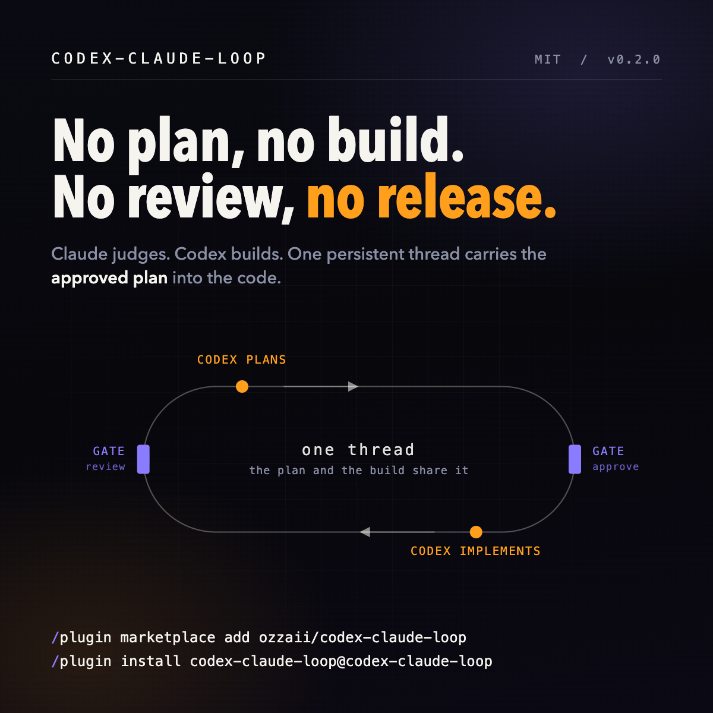

# codex-claude-loop



A gated build loop between Claude Code and Codex CLI. Codex writes the plan, Claude
approves it, Codex implements **that same plan from the same thread**, Claude reviews the
diff against it.

```
brief → codex plans → CLAUDE APPROVES → codex implements → CLAUDE REVIEWS → release
                          ▲ gate 1                              ▲ gate 2
                          cl_impl                               cl_release
                          refuses without it                    refuses without it
```

Both gates have a consumer, which is what makes them gates rather than notes: `cl_impl`
refuses to run unless the plan is approved *and* the plan file still hashes to what was
approved; `cl_release` refuses unless the review is approved *and* the tree still hashes
to what was reviewed.

Bash around `codex exec`. No MCP server, no daemon, no Python.

## Install

**In Claude Code** (recommended, updates handled for you):

```
/plugin marketplace add ozzaii/codex-claude-loop
/plugin install codex-claude-loop@codex-claude-loop
```

**Anywhere else** (installs the skill into `~/.claude/skills/`):

```bash
curl -fsSL https://raw.githubusercontent.com/ozzaii/codex-claude-loop/main/install.sh | sh
```

The installer runs `doctor` when it finishes, so you learn straight away whether your
Codex can drive the loop. Flags: `--dir <path>`, `--ref <tag>`, `--uninstall`.

You need [Codex CLI](https://developers.openai.com/codex/cli) (`npm i -g @openai/codex`
then `codex login`), plus `jq` and `git`.

## Use

In Claude Code: `/codex-claude-loop:wave <slug> <brief.md>` walks the whole cycle and
stops at both gates for your judgment. `/codex-claude-loop:status` shows where every slug
stands. `/codex-claude-loop:doctor` checks the substrate.

From a shell:

```bash
source ~/.claude/skills/codex-claude-loop/lib/codex-claude-loop.sh

cl_doctor
cl_plan  auth-rl briefs/auth-rl.md         # codex writes the plan, thread stays open
#   read the plan. Try to refute it. Then:
cl_record_verdict auth-rl plan approve "contracts and migration order hold"
cl_impl  auth-rl                           # same thread implements it, holds the lock
cl_review_human auth-rl                    # adversarial review of the diff vs the plan
cl_revise auth-rl "1) bucket resets on deploy, persist it  2) …"
cl_record_verdict auth-rl review approve "blockers cleared, tests green"
cl_release auth-rl                         # refuses unless both gates hold right now
cl_status
```

`cl_wave <slug> <brief.md>` drives the same sequence one step at a time. It returns 3
when it is your turn (read the plan, review the diff) and 0 once both gates hold, so you
re-run it after each judgment instead of watching it block.

Unattended, with nobody to judge: `cl_codex_gate <slug>` runs a Codex reviewer bound to
[`verdict.schema.json`](plugin/skills/codex-claude-loop/schemas/verdict.schema.json). It
defaults to `revise`, and an `approve` carrying blocking items gets downgraded on disk.

## Why the same thread

Most Claude + Codex setups paste a plan into a fresh Codex prompt, so Codex implements a
summary of reasoning it never did. Here `cl_plan` opens a persistent thread, has Codex
author the plan **as the implementer**, and stores the thread id. `cl_impl` resumes that
exact thread. The review gate judges the diff against the stored plan file, so "it built
something else, but nice" is a blocking finding rather than a shrug.

## Two lanes, pipelined

Implementation is the only serialized step, so planning the next brief is free to run
during it. Reviewing is not: a reviewer reading a tree that a writer is editing judges
half-written files, so `cl_review_human` and `cl_codex_gate` refuse while the writer lock
is held.

```
impl(N)        [======= writes tree, lock held =======]
plan(N+1)      [== read-only, overlaps freely ==]  approve ✓ → impl(N+1) next
review(N-1)                                        [== after the lock clears ==]
```

Genuine review/implement overlap needs the lanes in **separate worktrees**, one
`CL_REPO` each. That is what `CL_WRITABLE_ROOTS` exists for. Set
`CL_ALLOW_CONCURRENT_REVIEW=1` only if you accept reviewing a moving tree.

## What it refuses to do

A gate that always approves is worse than no gate.

- `cl_impl` refuses unless the plan verdict is `approve`
- an approval is bound to the plan text that was read: edit `plan.md` afterwards and the
  approval stops counting, because the verdict carries the plan's hash. A plan that
  cannot be hashed at all (deleted file, no sha256 tool) also voids it, rather than
  reading as "no mismatch found"
- `cl_record_verdict` refuses to record an approval it could never verify later
- `cl_impl` refuses without a stored thread id, and never falls back to `resume --last`
- review refuses when no implementation succeeded, and while a writer holds the lock
- `cl_release` refuses unless the review approved *this* tree: it compares the base sha
  and a hash of HEAD plus every uncommitted and untracked byte
- `cl_revise` keeps every round's blocking items, and each later review is handed them
  with instructions to judge intent rather than wording: a fix that satisfies the sentence
  and misses the point is still blocking
- a fresh `cl_plan` clears both verdicts, the recorded base, and the success marker;
  `cl_impl` and `cl_revise` clear the review approval before they touch the tree
- a failed autonomous gate leaves the slug **unapproved**: the standing verdict is
  cleared before the attempt, so a crash can never leave yesterday's approval in place
- `approve` plus a non-empty `blocking[]` becomes `revise`, rewritten in the file. A
  `blocking` that is not an array is refused outright rather than counted as zero
- a second `cl_impl` waits on the lock. A stale lock is reclaimed by renaming it, so two
  waiters cannot both reclaim, and only the owning pid may release

## Surviving a Codex update

The CLI moves, and a moved flag used to mean a lane that died silently into its log.

- `cl_doctor` probes the four capabilities the loop depends on (`exec --json`, `exec -o`,
  `exec --output-schema`, `exec resume`) by the exact spelling the driver invokes
- the thread id is read from a documented thread-start event, including renamed events
  and keys; a drifted shape is announced in the log, and an id that does not look like an
  id is refused rather than resumed
- a codex family outside the tested set prints one warning, then continues
- every phase declares the capabilities it needs, so a missing verb or flag produces a
  refusal that names the capability instead of a lane that dies in its log

## Config

| Env | Default | Notes |
|---|---|---|
| `CL_REPO` | git root of `$PWD` | the tree Codex writes |
| `CL_STATE` | `~/.codex-claude-loop/<repo>-<hash of its path>` | plans, verdicts, thread ids, logs, kept outside the repo. The path hash keeps `~/a/app` and `~/b/app` apart |
| `CL_ALLOW_CONCURRENT_REVIEW` | | `1` lets a review run while a writer holds the lock |
| `CL_SANDBOX` | `workspace-write` | implementation sandbox |
| `CL_PLAN_SANDBOX`, `CL_REVIEW_SANDBOX` | `read-only` | raise only on hosts where sandboxing itself fails |
| `CL_IMPL_MODEL`, `CL_PLAN_MODEL`, `CL_REVIEW_MODEL` | codex default | plan cheap, review strong |
| `CL_WRITABLE_ROOTS` | | needed when `CL_REPO` is a linked worktree |
| `CL_NET` | | `1` grants the sandbox network for test gates |
| `CL_LOCK_TIMEOUT` | `7200` | seconds to wait for the writer lock |

## Field notes

Each of these cost hours before it became a line of code.

- `codex exec resume <id>` rejects global flags placed after `resume`. `-C/-s/-o` go
  before it, or the lane dies silently in its log. Tail every lane within a minute.
- `codex review --base <sha> "<prompt>"` is invalid, `--base` cannot combine with a
  prompt. The reviewer runs `git diff` itself instead.
- The `--json` stream carries non-JSON stderr, and `jq` aborts at the first bad line.
  Filter `grep -a '^{'` before parsing.
- `zsh` expands a whole `local a="$1" b="${a}x"` line before assigning, so `b` is empty.
- Linked worktrees need `CL_WRITABLE_ROOTS`, or commits fail with `cannot lock ref`.
- Some hosts cannot run a sandboxed shell at all, which is what the per-phase sandbox
  variables are for.
- `cmd | grep -q pattern` under `set -o pipefail` reports failure when the match arrives
  early: `grep -q` closes the pipe and the producer takes SIGPIPE. Capture first, match
  second.
- An implementation of only new files looks like an empty diff, so the gate prompt forces
  `git status --short` too.
- `git status` and `git diff HEAD` describe an edited *untracked* file identically before
  and after the edit. Hashing a tree therefore has to hash untracked content too
  (`git hash-object`), or a file can move underneath an approval unnoticed.
- A memo helper written as `help="$(_load)"` caches into a subshell that then exits, so
  it never memoizes. The assignment has to happen in the calling shell.

Run `cl_selfreview` on day one: Codex tearing this harness apart before you trust it.

## Tests

```bash
./gates.sh             # smoke (bash + zsh) + shellcheck + manifest validation
bash test/smoke.sh     # 53 assertions, no Codex quota spent
```

The suite drives the whole loop against a stub `codex` that enforces the invocation
contract: it rejects a global flag placed after `resume`, demands `-C` and `-s`, and can
be told which thread id it must be resumed with. So "impl ran" also proves the flags were
placed correctly and the stored thread was the one resumed.

It then asserts that the gates gate: implementation refuses an unapproved plan, an
approval dies when its plan file moves or cannot be hashed, a failed autonomous gate
leaves no standing approval, `approve` with blockers is downgraded on disk, a `blocking`
that is not an array is refused, release refuses once the tree changes underneath it, a
review refuses while a writer holds the lock, a dead lock holder is reclaimed while a
live one blocks and only the owner may release, a slug cannot escape the state directory,
and a removed flag or verb produces a refusal rather than a silent death.

## Prior art

| | What it is | Use it when |
|---|---|---|
| [openai/codex-plugin-cc](https://github.com/openai/codex-plugin-cc) | Official plugin: `/codex:review`, `/codex:rescue`, background jobs | You want the primitives. It composes with this |
| [skills-directory/skill-codex](https://github.com/skills-directory/skill-codex) | A skill that forwards a prompt to Codex | One-shot delegation, no gates |
| [alexzh3/codex-orchestrator](https://github.com/alexzh3/codex-orchestrator) | Run artifacts, journals, reports (Python 3.10+) | You want reporting and don't mind Python |
| [iselur/relay](https://github.com/iselur/relay) | Autonomous backlog and cross-vendor review on a shared VM | You want unattended autonomy and will run infrastructure |
| **codex-claude-loop** | The loop discipline itself: two gates, one thread, one writer lock, schema-checked verdicts | You want it auditable in one file, with Claude actually gating |

## Provenance

Extracted from the harness behind [BRAVOH](https://beta.bravoh.ai), where it ran 45 gated
waves across 20 lanes of a production TypeScript and React Native codebase. Every field
note above comes from that run.

MIT.
